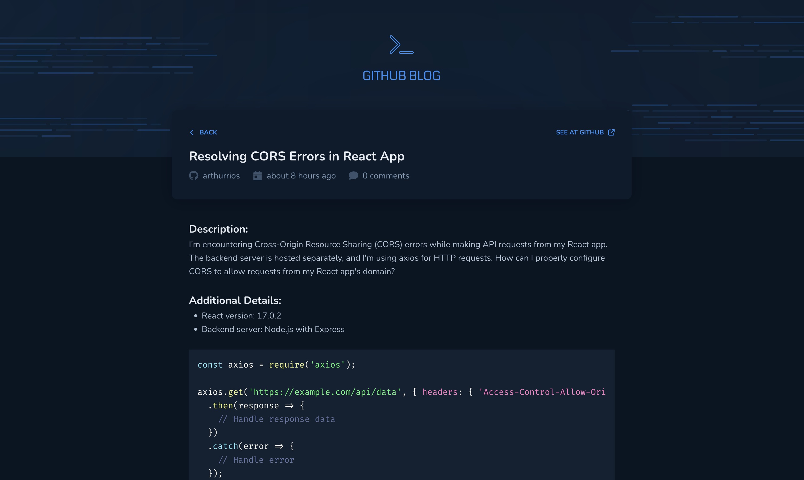

# Github Blog - Web

## The App
This is a blog type WebApp that lists Github issues from a existing repository. 
Make issues in your repo to showcase them in as a blog.

### Previews

  
  
  

### Techs
1. React
2. Typescript
3. Styled Components
4. Axios
5. React Router DOM
6. React Hook Form
7. Zod
8. Font Awesome

### Steps
1. Clone this repository;
2. Run your preferred command to install dependencies:
- `npm install`
- `yarn install` 
- `pnpm install` 
3. Fill your username and repository name in a `.env` file as the example inside `.env_example`; 
4. Run the app with: 
- `npm run dev`
- `yarn dev` 
- `pnpm run dev` 